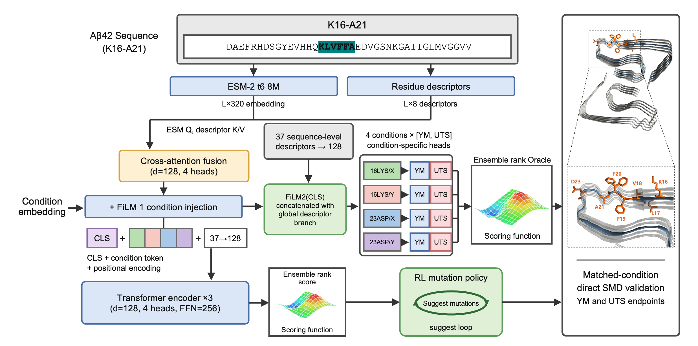

# Sequence-based Mechanical Design of Aβ42 Fibrils

This repository provides the dataset and analysis scripts for a sequence-based framework that prioritizes Aβ42 fibril variants for mechanical weakening and evaluates the nominated variants by steered molecular dynamics (SMD).



## Dataset

`data/dataset_540.csv` contains 540 sequence–condition records from 135 unique Aβ42 sequences, with Young's modulus and ultimate tensile strength measured under four loading conditions (16LYS/X, 16LYS/Y, 23ASP/X, 23ASP/Y).

`data/candidate_scores.csv` contains calibrated rank scores for 42,008 evaluated candidate sequences under each loading condition.

`data/single_substitutions.csv` contains rank scores for the 114 possible single substitutions within K16–A21.

`data/smd_cases.csv` and `data/smd_endpoints.csv` contain the composition of the ten direct SMD cases and their measured endpoints over three seed-matched pairs.

Rank scores are member-averaged ranks of the predicted endpoint against each ensemble member's training prediction distribution. Lower values indicate candidates prioritized for weakening. They are not MPa values, not physical reductions, and not probabilities.

## Requirements

```bash
pip install -r requirements.txt
```

## Usage

```bash
cd scripts
python run_dataset_summary.py     # measured endpoints by loading condition
python run_candidate_scores.py    # rank-score distributions of the candidate set
python run_smd_endpoints.py       # direct SMD endpoints against seed-matched WT
```

## Citation

Shin et al., *Sequence-Driven Mechanical Sabotage of Amyloid Fibrils via Transformer-Based Prediction and Reinforcement Learning*, Biomacromolecules, 2026. (under review)

Contact: saekomi5@korea.ac.kr

## Code Availability

<ins>**The full code for the condition-aware rank oracle and the reinforcement learning mutation policy is currently under patent application**</ins> and is not publicly available. The code will be made available upon reasonable request.
